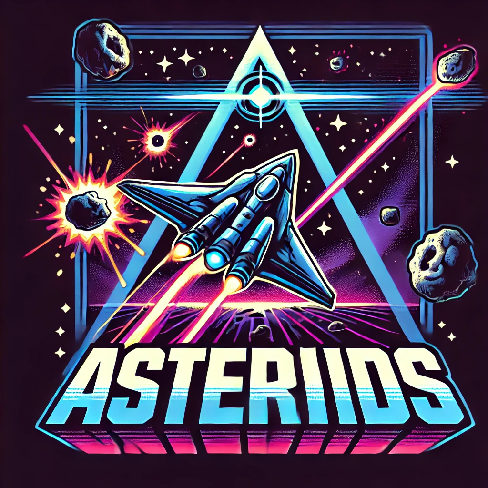

# Space Shooter Game

This is a simple 2D space shooter game where the player controls a space shuttle and shoots asteroids to score points. The game is built using HTML, CSS, and JavaScript. The objective is to survive as long as possible and achieve the highest score by destroying asteroids.

## Features

- **Space Shuttle Control**: Move the shuttle left and right using the arrow keys.
- **Shooting Mechanic**: Shoot bullets by pressing the spacebar to destroy asteroids.
- **Score System**: Earn points for each asteroid destroyed.
- **Game Over**: The game ends if an asteroid collides with the shuttle.
- **Menu Screen**: Start the game from the menu screen and view your final score after the game ends.

## How to Play
click on this link to play:
[link](https://fadiz911.github.io/Space-Shooter/)
1. **Start the Game**: Click the "Start" button on the menu screen to begin the game.
2. **Move the Shuttle**: Use the left (`←`) and right (`→`) arrow keys to move the shuttle.
3. **Shoot Asteroids**: Press the spacebar to shoot bullets and destroy asteroids.
4. **Avoid Collisions**: Avoid letting asteroids collide with the shuttle to keep the game going.
5. **Score Points**: Each asteroid destroyed increases your score.
6. **Game Over**: The game ends when an asteroid hits the shuttle. Your final score will be displayed on the menu screen.

## File Structure

- **index.html**: The main HTML file that contains the structure of the game.
- **style.css**: The CSS file that styles the game elements.
- **script.js**: The JavaScript file that handles the game logic, including shuttle movement, shooting, and collision detection.
- **Data/**: A directory containing the game assets (images and sounds).
  - `background.png`: The background image for the game.
  - `shuttle.png`: The image of the space shuttle.
  - `asteroid.png`: The image of the asteroids.
  - `shoot.mp3`: The sound effect for shooting bullets.

## Customization

- **Shuttle Speed**: Adjust the `shuttleSpeed` variable in `script.js` to change how fast the shuttle moves.
- **Asteroid Spawn Rate**: Modify the interval in the `setInterval(createAsteroid, 1000)` function in `script.js` to change how often asteroids spawn.
- **Bullet Speed**: Adjust the bullet movement speed by changing the value in the `bullet.style.bottom` update within the `shootBullet` function in `script.js`.

## Credits

- **Assets**: The game uses free assets for the shuttle, asteroids, and background.
- **Sound Effects**: The shooting sound effect is a simple placeholder sound.

## License

This project is open-source and available under the MIT License. Feel free to modify and distribute it as you see fit.

---

Enjoy the game and happy shooting! 🚀
